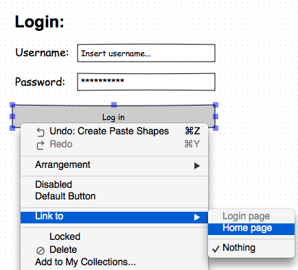
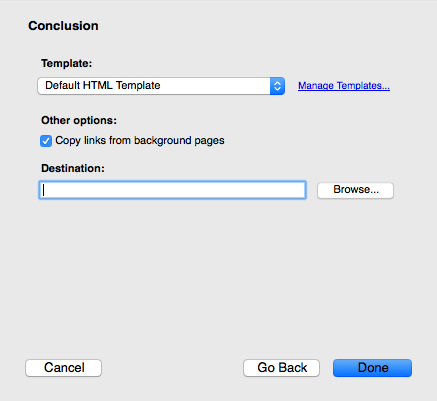
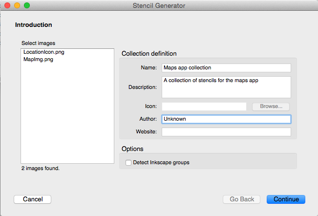
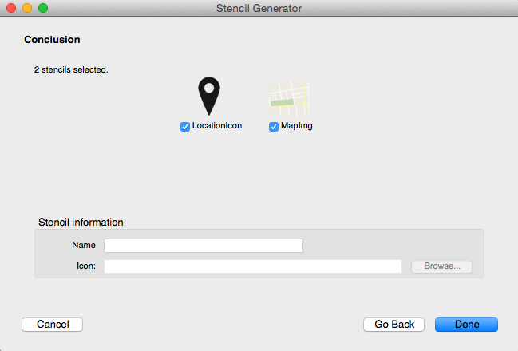
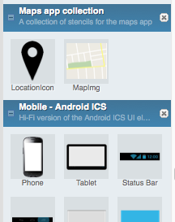
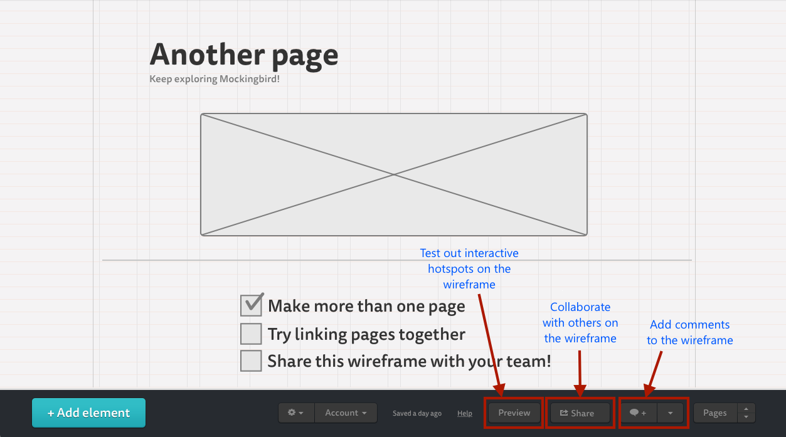
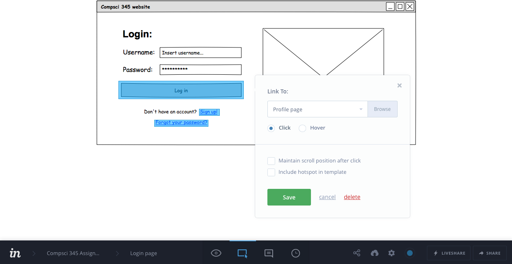
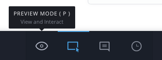
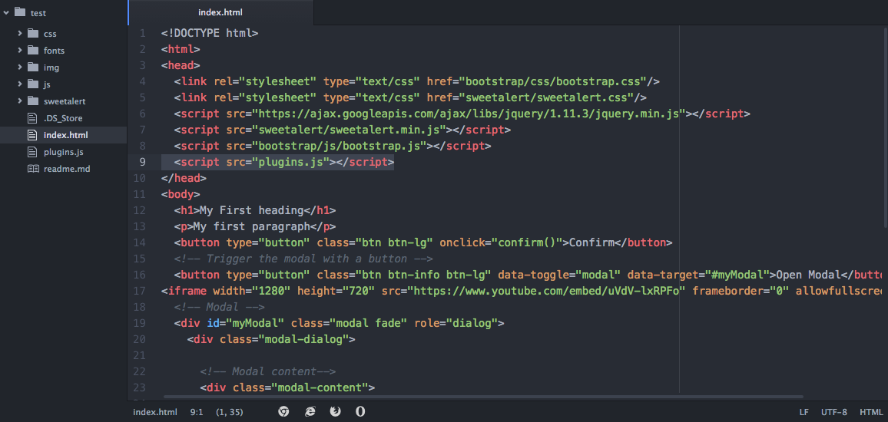
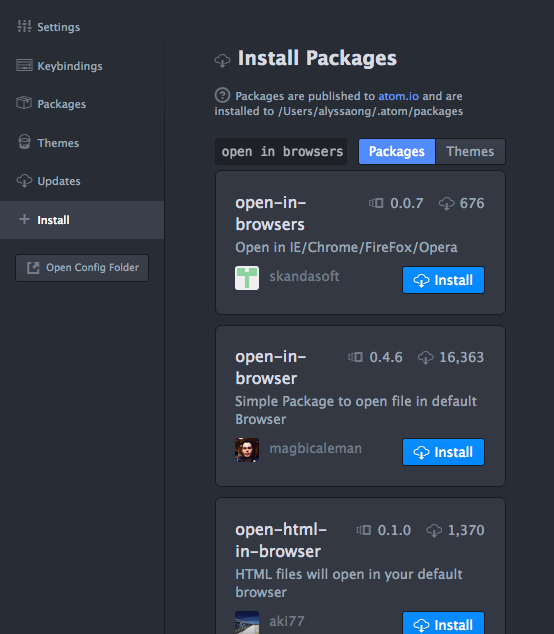

# Compsci 345 A3 Documentation

We will go through the various tools that will help you through Assignment 3. These tools act as a guideline - you need not follow it exactly, but it is what we recommend you use as best practice for your assignment.

## Digital Wireframing

You will have created paper wireframes in your previous assignment - this is an example of low fidelity wireframing. Digital wireframing is considered to be of higher fidelity, which will help you further solidify the form and function of your website in the design process. Here are a list of some tools you can use:

### 1. Pencil Project (recommended!)

Pencil Project is an open source wireframing tool that allows you to create wireframes for desktop and mobile apps. It's completely free to use - [download it here](http://pencil.evolus.vn).

In the left pane there are collections of stencils you can use for web and mobile wireframing. There are also  stencils for you to create diagrams. You could also use these to annotate your wireframe with notes. The top pane allows you to customize the stencils you insert.

#### Linking pages

Pencil allows you to link buttons to other pages to show the interaction and flow in your website. Right click the button you inserted into the canvas, then click on *Link to*. You can then choose which page the user will be navigated to when clicking the button.



However, you'll only be able to interact with the wireframes once you've exported it as a html page. To do this, go to *Document > Export Document...* Select the output to be **Single web page**, then hit continue.


Select which pages you wish to export, then continue. Click on *Browse...* and choose which folder you want the html page to be saved in, and make sure "Copy links from background pages" is ticked. Hit done.



Now, browse to the folder you saved it in. There should be a newly created html page. If you open the html page in your browser, you should see the wireframes you made all in one page. Try clicking on the buttons in your wireframes and it should navigate to the different webpages like you specified earlier.

#### Installing extensions

Pencil also allows you to install [additional collections](http://code.google.com/p/evoluspencil/downloads/list?q=label:Stencil) and [additional export templates](http://code.google.com/p/evoluspencil/downloads/list?q=label:Template). First of all, simply download the zip file of the extension you'd like. Let's use the Font Awesome collection as an example.


If you want to install a collection, go to *Tools > Install new collection...* in Pencil. If you want to install an export template, then go to *Tools > Manage Export Template...* in Pencil.


Select the zip file you just downloaded, and Pencil should automatically add in the collection/template, like this:


#### Creating your own collections

What if they don't provide the stencil you're looking for? No worries - you can add your own custom stencils in Pencil! Pencil can take an image file and turn it into a stencil that you can use in your wireframes. Let's say I'm making wireframes for a map app, and I wanted to add some stencils, e.g. a map and a location icon. Go to *Tools > Developer Tools > Stencil Generator..*. Drag your image file(s) into the listbox, and enter a name, short description and author for your collection. You can remove the website if you wish. Hit continue.



Make sure all the images are checked, then hit done.



Choose a location to save the zip file - this is the installation file for the collection of stencils you just made. Now, go to *Tools > Install new collection...* and select the zip file that was just generated. Your custom collection should now be added to the pane on the left (collections are ordered alphabetically), and you can now use the stencils you just uploaded.



### 2. Mockingbird

Mockingbird is a HTML5 app for creating wireframes, meaning that everything is done in your browser and no installation is needed. [Take me to Mockingbird](http://gomockingbird.com). You can only have one project at a time with the free version, but otherwise it is a neat wireframing tool with no restrictions on the number of stencils and pages you can create in that project.

On Mockingbird you can create many pages for your webpage wireframes. Start wireframing by dragging and dropping the controls in the left panel into your pages. Some cool features include adding comments on the wireframe and sharing the wireframe with others for collaborative editing.



#### Linking pages

To link buttons to pages in Mockingbird, you can double click on the button, click on *Link to page* and select a page you want the button to link to. Hit Preview to test the linking out.


#### Like grids?

You're in luck - Mockingbird happens to have grids as well. Click on the Settings icon (the cog) in the bottom pane, hover over columns, then select the number of grid columns per page you'd like.

#### Exporting your wireframes

Click on the Settings icon in the bottom pane, and hover over *Export*. You can either export your wireframes as a PDF or PNG. The downside of this is that your wireframes are no longer interactive (i.e. button navigation no longer works), but not to worry - Invision is here to help!

### 3. Invision

If you feel like the linking tools in Pencil weren't good enough, or you have screenshots of wireframes but don't know how to link them, then [Invision](http://invisionapp.com) is your best friend. It's completely free, and it'll turn those screenshots into interactive wireframes (a.k.a. click dummies).

After creating an account, click on the plus (+) sign and give your prototype a name and type. We'll be using Desktop (web) for the purposes of this assignment, but as you can see, you can also use Invision for mobile apps and even watches!


You'll need to upload the screenshots of your pages separately. If you need to split a PDF file into separate wireframe pages, [here's a tool you could use](http://smallpdf.com/split-pdf).


Click on one of the uploaded screens, then just click and drag on the screen to create hotspots.



These hotspots are basically the areas of interaction in your webpage. After creating a hotspot, you can specify a page it navigates to. Alternatively, you can also specify a certain point on the same screen that the hotspot will jump to when clicked. Hit P to go into preview mode and test those hotspots out!



### Also check out...

- [Balsamiq](http://balsamiq.com) - Free for the first 30 days, then you have to buy a license to save your work. You could screenshot the wireframes you make in Balsamiq to get around this. Otherwise a great wireframing tool with community-created stencils you can add.

- [Moqups](http://moqups.com) - Another HTML5 app for wireframing. The downside with Moqups is that the free version does not allow you to export your wireframes. Again you could get around this by taking screenshots of the wireframes you make in Moqups.

- [Creator Ionic](http://creator.ionic.io) - Very handy tool for creating interactive mobile wireframes!

## Building out your HTML pages

After creating your digital wireframes, it's good to build it out to see what your designs actually look like when applied to html pages. Here are some tools to help you create your html pages and develop your designs:

### 1. Atom

You may be wondering what to use to write all your code in. Well, it all starts with the atom. No literally, it does. [Atom](http://atom.io) is an open source text editor made by the folks at GitHub, and we recommend you use this to create your webpages. It's lightweight, powerful and extremely easy to use.

#### Adding a new or existing project

To start a new project, go to *File > Open...*. Navigate to where you want your new project to be saved, then create a new folder. This new folder is where all your files for the project will be stored. Select your newly created folder, then hit ok.

To add an existing project, do the same steps, except instead of creating a new folder you can just select your existing project folder.

You should see your folder (with any existing files) in the left hand pane. Click on the various files to view and edit them.



#### Adding packages to Atom

Being open source, Atom has awesome extensibility thanks to the work from other developers. We can easily add packages to Atom should we require additional functionality. To access the Atom settings pane for Macs, go to *Atom > Preferences...*. For Windows,... Click on the "Packages" tab - here you can see all the existing packages you have preinstalled packages that come with Atom. Click on the "Install" tab to start searching for packages online and installing them.

As an example, let's say we want to install a package that allows us to run our html file in many different browsers straight from Atom. To do this, we could install the [open-in-browsers](https://atom.io/packages/open-in-browsers) package. Open the Atom settings pane, go to the "Install" tab (as described above) and search for "open-in-browsers".



Hit install and that's it! Now, if you right click any html file in the left pane, you'll see the *Open in browsers* option which lets you run the html file in the browser of your choice. Check out all the packages [here](https://atom.io/packages) and have fun exploring!

#### Other text editors worth mentioning:

- [Sublime Text](http://sublimetext.com) - One of the most popular, easy-to-use text editors out there. The only downside is that you'll have to pay for the full version.

- [Visual Studio Code](http://code.visualstudio.com) - Fun fact: VS Code was built on Atom.

### 2. Bootstrap

Bootstrap is a mobile-first front-end framework that will make responsive web development a breeze. Long story short, it'll instantly help make stuff look pretty when you insert elements into your webpage, and help you add some really cool functionality to your webpage.

#### Adding Bootstrap to your project

To add Bootstrap to your project, head over to their [homepage](http://getbootstrap.com), click on Download Bootstrap, then click on Download Bootstrap again.


After unzipping, copy the contents of the bootstrap folder and paste it into the root of your project folder. We then need to reference the relevant scripts within the head tags of our html file, like this:

```html
<head>
  <link rel="stylesheet" type="text/css" href="css/bootstrap.css"/>
  <script src="https://ajax.googleapis.com/ajax/libs/jquery/1.11.3/jquery.min.js"></script>
  <script src="js/bootstrap.js"></script>
</head>
```

Note that Bootstrap has JavaScript plugins, and as such, jQuery is needed for these to work. Thus, we need the second line. You may also have a different folder structure depending on where you pasted the contents of the bootstrap folder - reference bootstrap.css and bootstrap.js according to your folder structure.

#### Using Bootstrap in your webpages

Luckily, Bootstrap provides great documentation on their webpage and has lots of community support. To see how Bootstrap is applied, let's try making a button to start off.

Insert the following line of code in the body tag of your html file:
```html
<button type="button" class="btn btn-primary btn-lg">Large button</button>
```
Run your html file in your browser. Your button should look something like this:


By adding classes, Bootstrap provides us with styles that we can apply to our button - no longer do we have the ugly default html button. For more Bootstrap button customizations, view the documentation [here](http://getbootstrap.com/css/#buttons). Scroll through the documentation to see the customizations you can apply on other elements too.

### 3. Colour schemes

Not sure where to start with picking the colour scheme for your website? Fear not! We've got some tools that will get you started.

### 4. jQuery plugins

jQuery plugins are a quick and powerful way to add more functionality to your website and make them more beautiful. These plugins are written by other developers and are usually open source, meaning you can freely use them in your website. The developers of these plugins usually write pretty good documentation on how to use the plugin in your website.

Check out some cool jQuery plugins:
- [Sweetalert](http://t4t5.github.io/sweetalert/) - Your alerts will never look boring again with Sweetalert.

- [Tubular](http://www.seanmccambridge.com/tubular/) - Want a youtube video as your background? Check this one out.

- [Tooltipster](http://iamceege.github.io/tooltipster/) - What about some cool looking tooltips?

There are thousands of jQuery plugins out there. After you design the functionality needed for your website, do a search for an existing jQuery plugins you could use to implement those functionalities. Note that some browsers don't work very well with jQuery plugins.

As an example, let's try implementing the sweetAlert plugin into our website. Go to the [Sweetalert homepage](http://t4t5.github.io/sweetalert/) and download using "Method 3: Download the sweetAlert CSS and JavaScript files". Unzip the file, and in the folder you should see a bunch of other files. The only files you need are the ones in the **dist** folder. Copy the dist folder, and paste it into the root folder of your project. For clarity, I've renamed dist to sweetalert.


Reference the CSS and JavaScript files for sweetAlert in your html file, like this:
```html
<link rel="stylesheet" type="text/css" href="sweetalert/sweetalert.css"/>
<script src="sweetalert/sweetalert.min.js"></script>
```
When you reference the CSS and JavaScript files, make sure the file paths are correct (i.e. where you pasted the sweetAlert files) - it may not be the same as ours. Let's create a button that triggers the sweetAlert when clicked. In your html file, add the following in your body tags:
```html
<button type="button" onclick="showalert()">Show me the alert!</button>
```
The line above adds an onclick listener to our button, meaning that when the button is clicked, the showalert function will be called. Now let's write the showalert function in JavaScript (our click event handler). To do this, we'll add a new JavaScript file to our project folder. A quick way to do this in atom is to right click the left pane (where you see all the files), then click *New File*. We will call it index.js. You can name it anything you like, so long as it ends with .js to indicate a JavaScript file. Then, reference the newly created JavaScript file in the html file, something like this:
```html
<script src="index.js"></script>
```
Again, make sure you use your own file path. For our example, let's use the success message sweetAlert. As shown in the documentation, copy and paste the following lines of code into the newly created JavaScript file.  
```javascript
function confirm(){
  swal("Good job!", "You clicked the button!", "success");
}
```
Here, we've created the confirm function that displays the sweetAlert. Run the html file in a browser, and click on the button. The sweetAlert should pop up. The sweetAlert homepage has documentation that shows tons of other kinds of sweetAlerts you can use - have fun exploring!
