# Compsci 345 A3 Documentation

We will go through the various tools that will help you through Assignment 3. These tools act as a guideline - you need not follow it exactly, but it is what we recommend you use as best practice for your assignment.

## Table of contents

- [Compsci 345 A3 Documentation](#compsci-345-a3-documentation)
	- [Table of contents](#table-of-contents)
	- [Digital Wireframing](#digital-wireframing)
		- [1. Pencil Project (recommended!)](#1-pencil-project-recommended)
			- [Linking pages](#linking-pages)
			- [Installing extensions](#installing-extensions)
			- [Creating your own collections](#creating-your-own-collections)
		- [2. Mockingbird](#2-mockingbird)
			- [Linking pages](#linking-pages)
			- [Like grids?](#like-grids)
			- [Exporting your wireframes](#exporting-your-wireframes)
		- [3. Invision](#3-invision)
		- [Also check out...](#also-check-out)
	- [Building out your HTML pages](#building-out-your-html-pages)
		- [1. Atom](#1-atom)
			- [Adding a new or existing project](#adding-a-new-or-existing-project)
			- [Adding packages to Atom](#adding-packages-to-atom)
			- [Other text editors worth mentioning](#other-text-editors-worth-mentioning)
		- [2. HTML, CSS and JavaScript](#2-html-css-and-javascript)
			- [Basics and overview](#basics-and-overview)
			- [Referencing CSS and JavaScript files](#referencing-css-and-javascript-files)
			- [Additional resources](#additional-resources)
		- [3. Bootstrap](#3-bootstrap)
			- [Adding Bootstrap to your project](#adding-bootstrap-to-your-project)
			- [Using Bootstrap in your webpages](#using-bootstrap-in-your-webpages)
			- [Customizing Bootstrap styles](#customizing-bootstrap-styles)
		- [4. Colour schemes](#4-colour-schemes)
			- [Adobe Color CC](#adobe-color-cc)
			- [Paletton](#paletton)
		- [5. Working with forms](#5-working-with-forms)
			- [Form appearance](#form-appearance)
			- [Handling form behaviour](#handling-form-behaviour)
			- [Form input validation](#form-input-validation)
		- [6. Storing data](#6-storing-data)
			- [How to use localStorage](#how-to-use-localstorage)
			- [Working with JSON objects in localStorage](#working-with-json-objects-in-localstorage)
		- [7. jQuery plugins](#7-jquery-plugins)


## Digital Wireframing

You will have created paper wireframes in your previous assignment - this is an example of low fidelity wireframing. Digital wireframing is considered to be of higher fidelity, which will help you further solidify the form and function of your website in the design process. Here are a list of some tools you can use:

### 1. Pencil Project (recommended!)

Pencil Project is an open source wireframing tool that allows you to create wireframes for desktop and mobile apps. It's completely free to use - [download it here](http://pencil.evolus.vn).

In the left pane there are collections of stencils you can use for web and mobile wireframing. There are also  stencils for you to create diagrams. You could also use these to annotate your wireframe with notes. The top pane allows you to customize the stencils you insert.


#### Linking pages

Pencil allows you to link buttons to other pages to show the interaction and flow in your website. Right click the button you inserted into the canvas, then click on *Link to*. You can then choose which page the user will be navigated to when clicking the button.


However, you'll only be able to interact with the wireframes once you've exported it as a html page. To do this, go to *Document > Export Document...* Select the output to be **Single web page**, then hit continue.

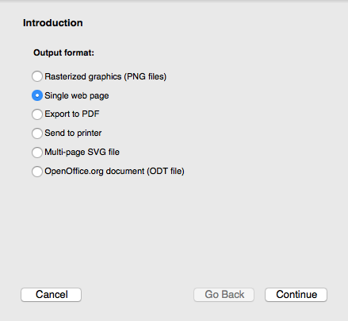

Select which pages you wish to export, then continue. Click on *Browse...* and choose which folder you want the html page to be saved in, and make sure "Copy links from background pages" is ticked. Hit done.


Now, browse to the folder you saved it in. There should be a newly created html page. If you open the html page in your browser, you should see the wireframes you made all in one page. Try clicking on the buttons in your wireframes and it should navigate to the different webpages like you specified earlier.

#### Installing extensions

Pencil also allows you to install [additional collections](http://code.google.com/p/evoluspencil/downloads/list?q=label:Stencil) and [additional export templates](http://code.google.com/p/evoluspencil/downloads/list?q=label:Template). First of all, simply download the zip file of the extension you'd like. Let's use the Font Awesome collection as an example.

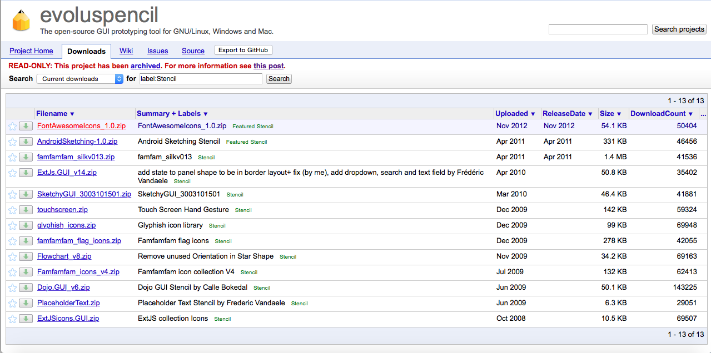

If you want to install a collection, go to *Tools > Install new collection...* in Pencil. If you want to install an export template, then go to *Tools > Manage Export Template...* in Pencil.

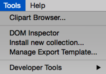

Select the zip file you just downloaded, and Pencil should automatically add in the collection/template, like this:

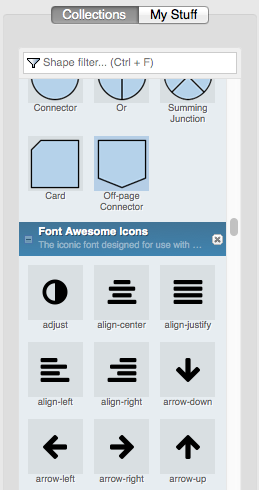

#### Creating your own collections

What if they don't provide the stencil you're looking for? No worries - you can add your own custom stencils in Pencil! Pencil can take an image file and turn it into a stencil that you can use in your wireframes. Let's say I'm making wireframes for a map app, and I wanted to add some stencils, e.g. a map and a location icon. Go to *Tools > Developer Tools > Stencil Generator..*. Drag your image file(s) into the listbox, and enter a name, short description and author for your collection. You can remove the website if you wish. Hit continue.


Make sure all the images are checked, then hit done.


Choose a location to save the zip file - this is the installation file for the collection of stencils you just made. Now, go to *Tools > Install new collection...* and select the zip file that was just generated. Your custom collection should now be added to the pane on the left (collections are ordered alphabetically), and you can now use the stencils you just uploaded.


### 2. Mockingbird

Mockingbird is a HTML5 app for creating wireframes, meaning that everything is done in your browser and no installation is needed. [Take me to Mockingbird](http://gomockingbird.com). You can only have one project at a time with the free version, but otherwise it is a neat wireframing tool with no restrictions on the number of stencils and pages you can create in that project.

On Mockingbird you can create many pages for your webpage wireframes. Start wireframing by dragging and dropping the controls in the left panel into your pages. Some cool features include adding comments on the wireframe and sharing the wireframe with others for collaborative editing.


#### Linking pages

To link buttons to pages in Mockingbird, you can double click on the button, click on *Link to page* and select a page you want the button to link to. Hit Preview to test the linking out.

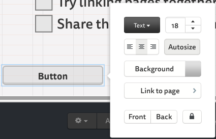

#### Like grids?

You're in luck - Mockingbird happens to have grids as well. Click on the Settings icon (the cog) in the bottom pane, hover over columns, then select the number of grid columns per page you'd like.

#### Exporting your wireframes

Click on the Settings icon in the bottom pane, and hover over *Export*. You can either export your wireframes as a PDF or PNG. The downside of this is that your wireframes are no longer interactive (i.e. button navigation no longer works), but not to worry - Invision is here to help!

### 3. Invision

If you feel like the linking tools in Pencil weren't good enough, or you have screenshots of wireframes but don't know how to link them, then [Invision](http://invisionapp.com) is your best friend. It's completely free, and it'll turn those screenshots into interactive wireframes (a.k.a. click dummies).

After creating an account, click on the plus (+) sign and give your prototype a name and type. We'll be using Desktop (web) for the purposes of this assignment, but as you can see, you can also use Invision for mobile apps and even watches!

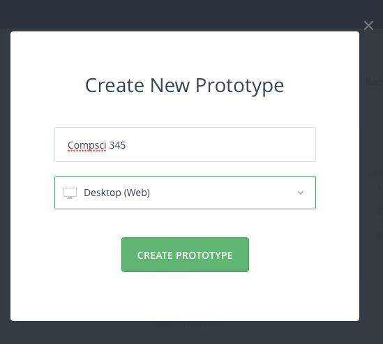

You'll need to upload the screenshots of your pages separately. If you need to split a PDF file into separate wireframe pages, [here's a tool you could use](http://smallpdf.com/split-pdf).

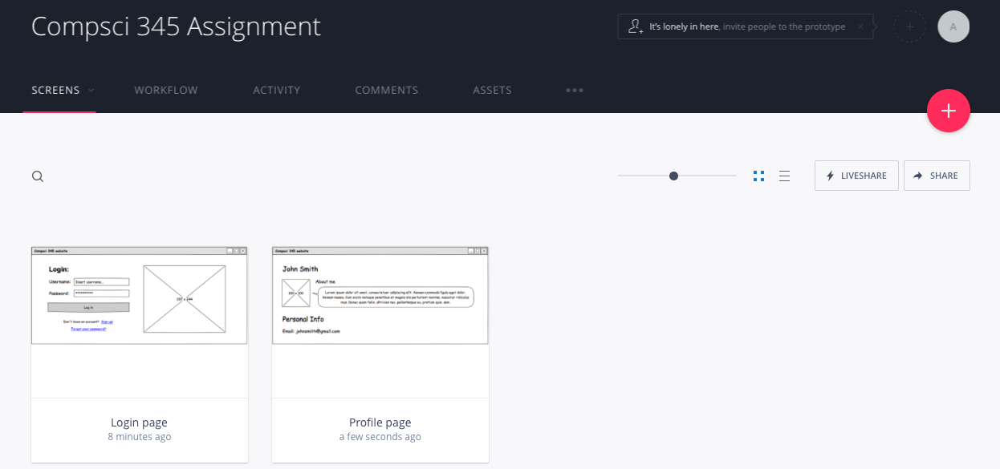

Click on one of the uploaded screens, then just click and drag on the screen to create hotspots.


These hotspots are basically the areas of interaction in your webpage. After creating a hotspot, you can specify a page it navigates to. Alternatively, you can also specify a certain point on the same screen that the hotspot will jump to when clicked. Hit P to go into preview mode and test those hotspots out!


### Also check out...

- [Balsamiq](http://balsamiq.com) - Free for the first 30 days, then you have to buy a license to save your work. You could screenshot the wireframes you make in Balsamiq to get around this. Otherwise a great wireframing tool with community-created stencils you can add.

- [Moqups](http://moqups.com) - Another HTML5 app for wireframing. The downside with Moqups is that the free version does not allow you to export your wireframes. Again you could get around this by taking screenshots of the wireframes you make in Moqups.

- [Creator Ionic](http://creator.ionic.io) - Very handy tool for creating interactive mobile wireframes!

## Building out your HTML pages

After creating your digital wireframes, it's good to build it out to see what your designs actually look like when applied to html pages. Here are some tools to help you create your html pages and develop your designs:

### 1. Atom

You may be wondering what to use to write all your code in. Well, it all starts with the atom. No literally, it does. [Atom](http://atom.io) is an open source text editor made by the folks at GitHub, and we recommend you use this to create your webpages. It's lightweight, powerful and extremely easy to use.

#### Adding a new or existing project

To start a new project, go to *File > Open...*. Navigate to where you want your new project to be saved, then create a new folder. This new folder is where all your files for the project will be stored. Select your newly created folder, then hit ok.

To add an existing project, do the same steps, except instead of creating a new folder you can just select your existing project folder.

You should see your folder (with any existing files) in the left hand pane. Click on the various files to view and edit them.


#### Adding packages to Atom

Being open source, Atom has awesome extensibility thanks to the work from other developers. We can easily add packages to Atom should we require additional functionality. To access the Atom settings pane for Macs, go to *Atom > Preferences...*. For Windows, go to *File > Settings*. Click on the "Packages" tab - here you can see all the existing packages you have preinstalled packages that come with Atom. Click on the "Install" tab to start searching for packages online and installing them.

As an example, let's say we want to install a package that allows us to run our html file in many different browsers straight from Atom. To do this, we could install the [open-in-browsers](https://atom.io/packages/open-in-browsers) package. Open the Atom settings pane, go to the "Install" tab (as described above) and search for "open-in-browsers".


Hit install and that's it! Now, if you right click any html file in the left pane, you'll see the *Open in browsers* option which lets you run the html file in the browser of your choice. Check out all the packages [here](https://atom.io/packages) and have fun exploring!

#### Other text editors worth mentioning

- [Sublime Text](http://sublimetext.com) - One of the most popular, easy-to-use text editors out there. The only downside is that you'll have to pay for the full version.

- [Visual Studio Code](http://code.visualstudio.com) - Fun fact: VS Code was built on Atom.

### 2. HTML, CSS and JavaScript

- TODO: Add resources for core concepts on CSS and Javascript

#### HTML

When we make websites, we start with making the html file. Html defines the structure and content of your webpage. The html language is made up of **html tags**, that look like this: `<tagname>content</tagname>`. Here's an example of some html tags:
```html
<!-- This tag defines large headers -->
<h1>Paragraph header</h1>
<!-- This tag defines paragraphs -->
<p>My first paragraph</p>
```
Let's try creating a table using html as another example. A table consists of a table header (a row with titles for each of the columns), and then there's the body of the table, which is made up of rows and columns that contain the content. A simple table in html would look like this:
```html
<table>
	<!-- The title row -->
	<tr>
		<th>Name</th>
		<th>Date of birth</th>
		<th>Email</th>
	</tr>
	<!-- The data rows -->
	<tr>
		<td>John Smith</td>
		<td>19/09/1955</td>
		<td>jsmith@gmail.com</td>
	</tr>
	<tr>
		<td>Rick Morty</td>
		<td>21/03/1987</td>
		<td>rmorty@yahoo.com</td>
	</tr>
</table>
```
As you can see, the tr tag represents each row of the table, the th tag represents a table column title and the td tag represents the columns that contain content.

Some other commonly used html elements you should have a read up on are:
- Paragraphs
- Links
- Image and backgrounds

#### CSS

After defining the structure of the page, we also need to customize the styling of the page elements, such as its colour, size, or font. It is possible to do this in the html file itself, but it can make it very messy. Hence, we use *css* to define the presentation and styling of our html document. We write our css code in another css file separate from the html file. Here's an example of css being applied to a html document:
```css
h1 {
	color: orange; /* This makes the header text orange */
	text-align:center; /* This centers the header */
}

p {
	font-family: "Times New Roman";
	font-size: 20px;
}
```
Let's use css to style a table as another example. We'll increase the padding around each column, like this:
```css
td {
	/* Select all the td (column) elements and space them out*/
	padding: 20px;
}
```
You should also read up on how css can be used to style:
- Fonts
- Colours
- Borders

#### JavaScript

Lastly, we need a way to describe the behaviour of our webpage. For instance, when the "submit" button of a form is clicked, the form data is captured and sent to a server. We use *JavaScript* to define the behaviour of our webpage. Like css, we usually write our JavaScript code in another js file separate from the html file. This way, our html file is much neater. Here's an example:

Let's say our html has this button
```html
<button type="button" id="submitBtn">Submit form!</button>
```

To configure what happens when the submit button is clicked, our JavaScript would look like this
```javascript
// Get the submit button from the html by its id
var myButton = document.getElementById("submitBtn");

// When the submit button is clicked, execute myFunction
submitBtn.addEventListener("click", myFunction);

function myFunction(){
	// This function gets called when the submit button is clicked
}
```

Some core JavaScript concepts you should read up on are:
- Variables
- Functions
- Events, listeners and handlers

So as a whole, html defines the page structure, and css and JavaScript "add" onto html to define style and behaviour.

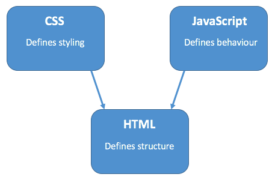

#### Referencing CSS and JavaScript files

To tell the html file to use our separate css and JavaScript files, we need to **reference** our external css and JavaScript files in the html file. Say for instance we named our css file "mystyle.css", and our js file "mybehaviour.js". We would need to have these lines in the <head> section of our html:
```html
<!-- Referencing CSS files -->
<link rel="stylesheet" type="text/css" href="mystyle.css"/>
<!-- Referencing js files -->
<script src="mybehaviour.js"></script>
```
Note that if you put your css or js files in folders, you would need to reference it relatively. So for example if your "mystyle.css" file were saved in a folder called "css", you'd need to reference it like this instead:
```html
<!-- Using relative link -->
<link rel="stylesheet" type="text/css" href="css/mystyle.css"/>
```

#### Additional resources

If you feel that your html, css and/or JavaScript is very weak, we definitely recommend you try these really **awesome** hands-on tutorials to learn and practice coding in html, css and JavaScript:

- [HTML and CSS](https://www.codecademy.com/learn/web)
- [JavaScript](https://www.codecademy.com/learn/javascript)

Think you already know html, css and/or JavaScript but just need a refresher? Here are some good tutorials you can read through:

- [HTML](http://www.w3schools.com/html/default.asp)
- [CSS](http://www.w3schools.com/css/)
- [JavaScript](http://www.w3schools.com/js/)

### 3. Bootstrap

Bootstrap is a mobile-first front-end framework that will make responsive web development a breeze. Long story short, it'll instantly help make stuff look pretty when you insert elements into your webpage, and help you add some really cool functionality to your webpage. You won't be allowed to use templates though.

#### Adding Bootstrap to your project

To add Bootstrap to your project, head over to their [homepage](http://getbootstrap.com), click on Download Bootstrap, then click on Download Bootstrap again.


After unzipping, copy the contents of the bootstrap folder and paste it into the root of your project folder. We then need to reference the relevant scripts within the head tags of our html file, like this:

```html
<head>
  <link rel="stylesheet" type="text/css" href="css/bootstrap.css"/>
  <script src="https://ajax.googleapis.com/ajax/libs/jquery/1.11.3/jquery.min.js"></script>
  <script src="js/bootstrap.js"></script>
</head>
```

Note that Bootstrap has JavaScript plugins, and as such, jQuery is needed for these to work. Thus, we need the second line. You may also have a different folder structure depending on where you pasted the contents of the bootstrap folder - reference bootstrap.css and bootstrap.js according to your folder structure.

#### Using Bootstrap in your webpages

Luckily, Bootstrap provides great documentation on their webpage and has lots of community support. To see how Bootstrap is applied, let's try making a button to start off.

Insert the following line of code in the body tag of your html file:
```html
<button type="button" class="btn btn-lg">Large button</button>
```
Run your html file in your browser. Your button should look something like this:


By adding classes, Bootstrap provides us with styles that we can apply to our button - no longer do we have the ugly default html button. For more Bootstrap button customizations, view the documentation [here](http://getbootstrap.com/css/#buttons). Scroll through the documentation to see the customizations you can apply on other elements too. If you want tutorials on how to use Bootstrap, refer to [this link](http://www.w3schools.com/bootstrap/).

#### Customizing Bootstrap styles
It's highly likely that you'd want to use your own colour scheme, borders and fonts for your website elements. The good news is, we can customize Bootstrap's styles by overriding the CSS classes with our own styles. As an example, let's try customizing the colour and border of the large button we made.

First of all, let's make a CSS file called "custom.css". This is where all the customization for the Bootstrap styles will go. To customize the button, we need to figure out which part of the CSS needs to be changed. If you right click the large button (in your browser) and click "Inspect Element", a pane appears that lets you see the styles that are being applied to the selected element. You can modify CSS in the pane itself to see your styles being applied in real time. [Here](https://www.youtube.com/watch?v=3zSUIm1KrPs) is a video showing you how you can do this.

Let's try making the background of the button a different colour in the Inspect Element CSS pane. As you can see, the colour is coming from the background-color attribute of the .btn-primary class. We can either change the background-color attribute in the .btn-primary style directly, or we can add a background-color attribute to the .btn-lg class and override the default style by Bootstrap.

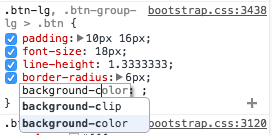

You should be able to see the colour of your button changing on the spot as you modify the background-color attribute in the inspector. Now that we've identified the classes that affect the colour of the button, we need to override these in our custom.css file.

Go back to your code, and copy and paste the following snippet into the custom.css file:
```css
.btn-lg{
  background-color: #5C2D91;
	color: #FFFFFF;
}
```
In this snippet of code we made the background color of the button purple, and the button font white. There's just one more thing we have to do, and that's referencing the css file in our html file. Go to the index.html file and add this line below the <head> tag:

```html
<link rel="stylesheet" type="text/css" href="custom.css"/>
```

Run the html file in the browser and you should see that the button now looks like this:


But what if you only wanted to change the colour for one particular button without affecting the styles of all other large buttons you add into your website in future? To do this, you can attach an id to the button in the html file, then modify the background colour by selecting the id from the css. So your html code for the button would look like this:
```html
<button type="button" class="btn btn-lg" id="myPurpleBtn">Large btn</button>
```
And your css for that particular button would look like this:
```css
#myPurpleBtn{
  background-color: #5C2D91;
  color: #fff;
}
```
The styling is now unique to that button.

#### Using Bootstrap icons

In Bootstrap, icons are called **glyphicons**, or glyphs. You may have noticed when you added Bootstrap to your project, there was a folder called "fonts" that had glyphicon-halfling files. These are what Bootstrap uses to support icons in your website. Let's try adding some glyphs to our webpage. Go to your index.html file and add the following inside the <body> tag:
```html
<p>Envelope icon: <span class="glyphicon glyphicon-envelope"></span></p>
<p>Search icon: <span class="glyphicon glyphicon-search"></span></p>
```
Run the html file in your browser, and you should see the following:


For a full list of glyphs you can use, refer to [this link](http://www.w3schools.com/bootstrap/bootstrap_ref_comp_glyphs.asp). If you feel that Bootstrap's glyphs don't provide you with enough icons for your website, you should definitely check out [Font Awesome](https://fortawesome.github.io/Font-Awesome/). They have a much larger range of icons available for you to use - view their list of icons [here](https://fortawesome.github.io/Font-Awesome/icons/).

### 4. Colour schemes

Every website should have a colour scheme. Picking the colour scheme can be a bit of a challenge, but fortunately we've got some tools that will get you started.

#### Adobe Color CC

[Try it out!](https://color.adobe.com) Adobe Color CC allows you to pick your colour scheme based on colour rules, like analogous, monochromatic and complementary. After you select a colour rule, try dragging the circles on the colour wheel around - the colour palette automatically readjusts itself according to the colour rule you selected.

#### Paletton

[Try it out!](http://paletton.com) Paletton also lets you pick your colour scheme based on colour rules, but with more customization and control available. Hover over the various colours and shades in the square palette to view their hex codes.

- TODO: insert annotated image of how to use paletton

### 5. Working with forms

It is extremely common for websites to take in user input, such as filling in a feedback form, registering for an online account, or logging in. We generally use forms for this. Forms contain a whole bunch of controls that collect user input with a submit button at the end - you can read more about forms [here](http://www.w3schools.com/html/html_forms.asp). Let's use a feedback form as an example. We will first create a feedback form in html, then retrieve user input with  JavaScript upon clicking the submit button.

#### Form appearance

Bootstrap provides styling for forms, which we will use. For more detail on Bootstrap forms, check out [this link](http://www.w3schools.com/bootstrap/bootstrap_forms.asp). The next 3 chapters have more info on Bootstrap form inputs which are very handy when you try to customize your form. Go into your index.html page and copy paste the following lines of code in the <body> tag:
```html
<!-- Feedback form-->
<form role="form" name="feedbackform" id="feedbackform">
	<!-- Name textbox -->
	<div class="form-group">
		<label for="name">Name:</label>
		<input type="name" class="form-control" id="name">
	</div>
	<!--Feedback textarea -->
	<div class="form-group">
		<label for="feedback">Feedback:</label>
		<textarea class="form-control" rows="5" id="feedback"></textarea>
	</div>
	<!-- Submit button -->
	<button type="submit" class="btn btn-default">Submit</button>
</form>
```
Textarea is one of Bootstrap's form inputs. Check [this link](http://www.w3schools.com/bootstrap/bootstrap_forms_inputs.asp) out for more of Bootstrap's form inputs. Run the index.html in your browser and you should see a simple feedback form. Now, we need to handle the form's behaviour in our JavaScript code.

#### Handling form behaviour

When the user clicks on the form's submit button, we want to collect their input. More specifically, we want to 'listen' for the 'submit' event, and then read the form inputs. We recommend you read [this]() before continuing. Create a file named *index.js* in your js folder, then reference it in your html like this:
```html
<script src="js/index.js"></script>
```
Copy and paste the following into your JavaScript file:
- TODO: document.onContentLoaded
```javascript
// Create a variable that contains your feedback form
var form = document.forms.feedbackform;

// Attach a "submit" listener to your feedback form, and define the function that is called when the event is triggered
form.onsubmit = function (e){
	// Prevent the page from refreshing
	e.preventDefault();
	// Collect user input and store it as a feedback object
	var newFeedback = {
		name: document.getElementById("name").value,
		feedback: document.getElementById("feedback").value
	}
	// Show the newFeedback object in the console
	console.log(newFeedback);
	// Clear all form fields
	form.reset();
};
```
Run the html file in your browser, then go *right click > Inspect Element*. When you write values into the form and submit it, you should see the newFeedback object being printed in your console. Expand the object and you can see the values you input into the form being saved into the newFeedback object.

#### Form input validation

Form validation is basically making sure the user enters healthy inputs before submitting the form. For instance, making sure an entered name is at least 4 characters in length, or preventing the user from submitting blank feedback. We can add attributes to input elements for form validation. For instance, one would use the `required` attribute to denote that the input value cannot be left as blank, and the `minlength` attribute to denote that the input value must have a  minimum number of characters. Let's apply some validation to our existing form by making the following changes to your code:
```html
<!-- Change the line with the name input to this -->
<input type="name" minlength="4" class="form-control" id="name" required>
```
```html
<!-- Change the line with the feedback input to this -->
<textarea class="form-control" rows="5" id="feedback" required></textarea>
```
We've made it so that both name and feedback inputs must be filled out before the form is successfully submitted, and the name input has to have a minimum length of 4 characters. Run the html file in the browser, then try violating some of the validation rules during submission e.g. leaving both inputs blank and clicking the submit button. You can see that you won't be able to submit the form, and the form tells you what you need to do to fulfill the validation requirements. To find out more input attributes you can add, check [this link](http://www.w3schools.com/html/html_form_attributes.asp) out.

### 6. Storing data

It is extremely common for websites to take in user input and store it, and chances are you'll want to do this for your website too. To bypass all the complications of setting up a backend to store our data, we recommend you use client side storage called **localStorage**. With localStorage, websites can store data locally in the user's browser. More outdated browser versions may not support localStorage - [check this link out](http://www.w3schools.com/html/html5_webstorage.asp) to see if your browser version supports it.

You may be thinking - what if I close my browser, or clear my history or clear my cache? Does this mean all the data in localStorage will be wiped out? The answer is **no**, your data will still exist in localStorage if you close your browser window, and our data will be stored with no expiration date. So the data will still be there a day, week, month and even a year later.

#### How to use localStorage

Using localStorage is easy. Everything is done by calling methods on the `localStorage` object in JavaScript. localStorage stores data in name/value pairs. For instance:
```javascript
localStorage.setItem('favouriteflavour', 'vanilla');
```
has the name 'favouriteflavour', with the value 'vanilla'. If we want to retrieve this data from localStorage, we would need to call the getItem method, like this:
```javascript
var myfavouriteflavour = localStorage.getItem('favouriteflavour');
```
The variable myfavouriteflavour would be 'vanilla'. Lastly, if you want to delete this item from localStorage, we would have to call the removeItem method, like this:
```javascript
localStorage.removeItem('favouriteflavour');
```

#### Working with JSON objects in localStorage

What if we want to store objects which have many attributes each, e.g. a "user" object has a name, date of birth, email address, etc. To address this, we can use JSON to represent our objects. If you are unsure of what JSON is, [read this](http://www.w3schools.com/json/json_syntax.asp). However, one limitation with localStorage is that you can only store strings - so if you tried to store a JSON object into localStorage it wouldn't work. To get around this, we can convert our JSON objects into strings first, then store it in localStorage. Let's use our "user" object mentioned earlier as an example:
```javascript
var user = {
	name: "John Smith",
	dob: "12/07/1990",
	email: "jsmith@hotmail.com"
}
```
We have created a "user" object, and it is currently in JSON format. To convert our "user" object into a string, we use the JSON.stringify method on the user object. Overall, the code to convert our object into a string and save it into localStorage would look like this:
```javascript
localStorage.setItem('user', JSON.stringify(user));
```
If we need to retrieve the JSON object from storage, we retrieve the string, then convert it back into JSON format using the JSON.parse method:
```javascript
// Retrieve string from localStorage
var userString = localStorage.getItem('user');
// Convert string to JSON format
var user = JSON.parse(userString);
```
This only stores one "user" object though. What if we wanted to store multiple user objects? To do this, we could save an array of JSON objects. If you've never worked with arrays of JSON objects before, read the JSON Arrays section of [this link](http://www.w3schools.com/json/json_syntax.asp). Our array of users would look something like this:
```javascript
var users = [
	{
		name: "John Smith",
		dob: "12/07/1990",
		email: "jsmith@hotmail.com"
	},
	{
		name: "Ben Jones",
		dob: "21/06/1993",
		email: "bjones@hotmail.com"
	}
]
```
Here we have an array containing 2 user objects, but you can add as many users as you'd like to the array. You can even have one object in the array. We would then store this array in a similar way to storing JSON objects. We convert it into a string before storing it, like this:
```javascript
var usersString = localStorage.setItem('users', JSON.stringify(users));
```
To retrieve our JSON array, we would do the following:
```javascript
// Retrieve string from localStorage
var usersString = localStorage.getItem('users');
// Convert string to JSON format
var users = JSON.parse(usersString);
```
Think of it as saving user records to a user table in a database. It's pretty much  `localStorage.setItem('yourTableName', JSON.stringify(yourTableData));`.

### 7. jQuery plugins

jQuery plugins are a quick and powerful way to add more functionality to your website and make them more beautiful. These plugins are written by other developers and are usually open source, meaning you can freely use them in your website. The developers of these plugins usually write pretty good documentation on how to use the plugin in your website.

Check out some cool jQuery plugins:
- [Sweetalert](http://t4t5.github.io/sweetalert/) - Your alerts will never look boring again with Sweetalert.

- [Tubular](http://www.seanmccambridge.com/tubular/) - Want a youtube video as your background? Check this one out.

- [Tooltipster](http://iamceege.github.io/tooltipster/) - What about some cool looking tooltips?

There are thousands of jQuery plugins out there. After you design the functionality needed for your website, do a search for an existing jQuery plugins you could use to implement those functionalities. Note that some browsers don't work very well with jQuery plugins.

As an example, let's try implementing the sweetAlert plugin into our website. Go to the [Sweetalert homepage](http://t4t5.github.io/sweetalert/) and download using "Method 3: Download the sweetAlert CSS and JavaScript files". Unzip the file, and in the folder you should see a bunch of other files. The only files you need are the ones in the **dist** folder. Copy the dist folder, and paste it into the root folder of your project. For clarity, I've renamed dist to sweetalert.


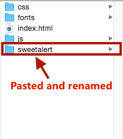

Reference the CSS and JavaScript files for sweetAlert in your html file, like this:
```html
<link rel="stylesheet" type="text/css" href="sweetalert/sweetalert.css"/>
<script src="sweetalert/sweetalert.min.js"></script>
```
When you reference the CSS and JavaScript files, make sure the file paths are correct (i.e. where you pasted the sweetAlert files) - it may not be the same as ours. Let's create a button that triggers the sweetAlert when clicked. In your html file, add the following in your body tags:
```html
<button type="button" onclick="showalert()">Show me the alert!</button>
```
The line above adds an onclick listener to our button, meaning that when the button is clicked, the showalert function will be called. Now let's write the showalert function in JavaScript (our click event handler). To do this, we'll add a new JavaScript file to our project folder. A quick way to do this in atom is to right click the left pane (where you see all the files), then click *New File*. We will call it index.js. You can name it anything you like, so long as it ends with .js to indicate a JavaScript file. Then, reference the newly created JavaScript file in the html file, something like this:
```html
<script src="index.js"></script>
```
Again, make sure you use your own file path. For our example, let's use the success message sweetAlert. As shown in the documentation, copy and paste the following lines of code into the newly created JavaScript file.  
```javascript
function showalert(){
  swal("Good job!", "You clicked the button!", "success");
}
```
Here, we've created the confirm function that displays the sweetAlert. Run the html file in a browser, and click on the button. The sweetAlert should pop up, and it looks like this:

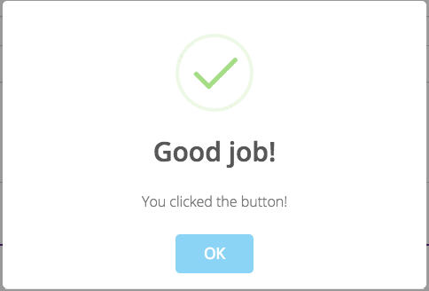

The sweetAlert homepage has documentation that shows tons of other kinds of sweetAlerts you can use - have fun exploring!
